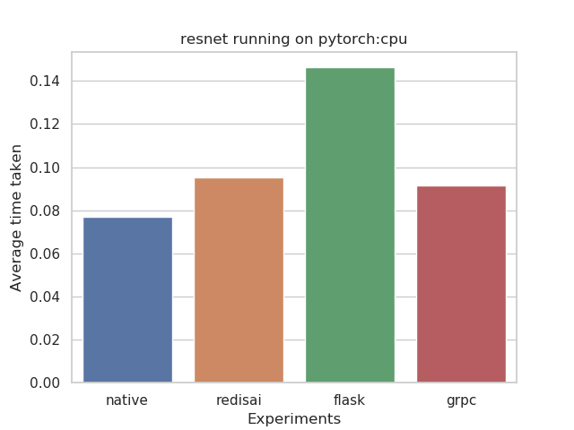

# This is a very OLD benchmarking suite we have made for experimenting and keeping it here for the records. The numbers/results shown here are not valild anymore. RedisAI has grown from there, quite a lot since then. Head over to the [new benchmarking suite] (https://github.com/RedisAI/aibench) we have made for the latest results

# benchmarks

This repo aims to benchmark RedisAI against everything else which includes

- RedisAI with Tensorflow as backend vs Tensorflow python runtime
- RedisAI with PyTorch as backend vs PyTorch python runtime
- RedisAI vs GRPC servers (Tensorflow Serving & custom GRPC server for PyTorch and ONNX)
- RedisAI vs Flask servers
- RedisAI with ONNX as backend vs ONNXRuntime (upcoming)
- RedisAI vs MxNet Model Server (upcoming)
- RedisAI vs TensorRT (upcoming)

Models used in for the benchmark can be found [here](https://app.box.com/s/r4xzm4xtzdqhmg4rbwfcahj9tee3ojbl) and the docker images can be found in the [docker hub](https://hub.docker.com/r/tensorwerk/raibenchmarks)


## Current Results

- OS Platform and Distribution: Linux Ubuntu 18.04
- Device: CPU
- Python version: 3.6
- Tensorflow version: 1.12.0
- TensorFlow optimizations: ON




(grpc for tensorflow is TFServing)

## Run experiments

For running the benchamarks (right now it runs with Tensorflow which is built with optimizations ON, if your hardware doesn't support it, keen an eye on this repo, we'll update it soon with prebuilt binary of TF available in pypy), cd to the repo and run 

```bash
python run.py
```

This will pull the required docker images, bring it up when requires and run the clients for each.
Available command line configurations are 

```
usage: run.py [-h] [--device {cpu,gpu,all}]
              [--backend {tensorflow,pytorch,all}] [--count COUNT] [--exp ...]

optional arguments:
  -h, --help            show this help message and exit
  --device {cpu,gpu,all}
                        Run benchmarking for CPU or GPU or both
  --backend {tensorflow,pytorch,all}
                        Run benchmarking for tensorflow or pytoch or onnx
  --count COUNT         How many iterations to take average from, for each
                        experiment
  --exp ...
```

`--exp` is for specifying experiments which are currently native, flask, redisai, grpc. Make sure `--exp` is specified at the end of your command. An example command to run only redisai and flask of pytorch, only two times is below

```bash
python run.py --backend pytorch --count 2 --exp flask redisai
```
